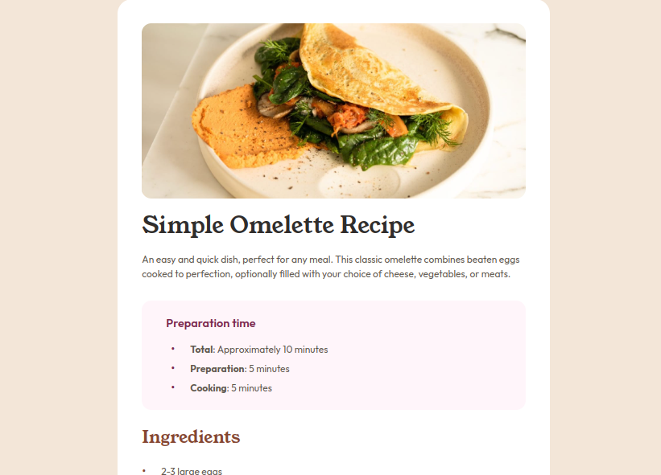

# Frontend Mentor - Recipe page solution

This is a solution to the [Recipe page challenge on Frontend Mentor](https://www.frontendmentor.io/challenges/recipe-page-KiTsR8QQKm). Frontend Mentor challenges help you improve your coding skills by building realistic projects. 

## Table of contents

- [Overview](#overview)
  - [Screenshot](#screenshot)
  - [Links](#links)
- [My process](#my-process)
  - [Built with](#built-with)
  - [What I learned](#what-i-learned)
  - [Continued development](#continued-development)
- [Author](#author)


## Overview

### Screenshot




### Links

- Solution URL: [Add solution URL here](https://your-solution-url.com)
- Live Site URL: [Add live site URL here](https://your-live-site-url.com)

## My process

### Built with

- Semantic HTML5 markup
- CSS custom properties
- Flexbox

### What I learned

Neste projeto aprendi a estilizar os marcadores de lista utilizando ::marker e ::before, como no snippet abaixo. Também aprendi a estilizar bordas de tabela que extrapolam a largura da tabela.

Snippet para estilizar marcadores de lista
```css
.item-prep::before {
    content: '•';
    color: hsl(332, 51%, 32%);
    font-size: 1.3rem;
    position: absolute;
    left: 0;
    top: -0.25rem;
}
```
Snippet para estilizar bordas de tabela que extrapolam a largura da tabela
```css
th::after, td::after {
    content: "";
    position: absolute;
    left: 0;
    right: 0;
    bottom: 0;
    height: 0.07rem;
    background-color: hsl(30, 18%, 87%);
    transform: translateX(-10px); 
    width: calc(100% + 20px); 
}
```

### Continued development

Desejo dar prosseguimento em estudos de media queries e demais propriedades de responsividade. Também compreender melhor a propriedade position.


## Author

- Frontend Mentor - [@eros77sc](https://www.frontendmentor.io/profile/yeros77sc)